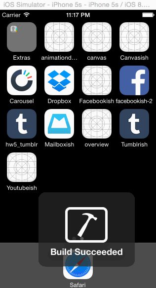

# iOS prototype of the Tumblr app

This is an iOS prototype of Tumblr, completed for Codepath. [See this week's assignment](http://courses.codepath.com/courses/ios_for_designers/week/5#!assignment).

__Time spent:__ About 8 hours

__Project Requirements__

* [x] Tapping on Home, Search, Account, or Trending should show the respective screen and highlight the tab bar button.
* [x] Compose button should modally present the compose screen.
* [x] Optional: Compose screen is faded in while the buttons animate in.
* [ ] Optional: Login button should show animate the login form over the view controller.
* [x] Optional: Discover bubble should bob up and down unless the SearchViewController is tapped.

### Walkthrough of app

gif created with [licecap](http://www.cockos.com/licecap)
